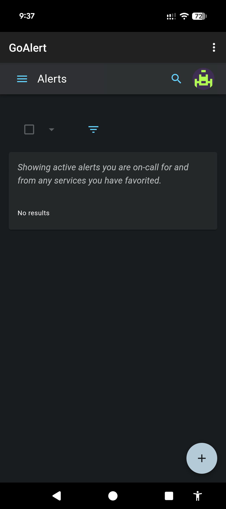
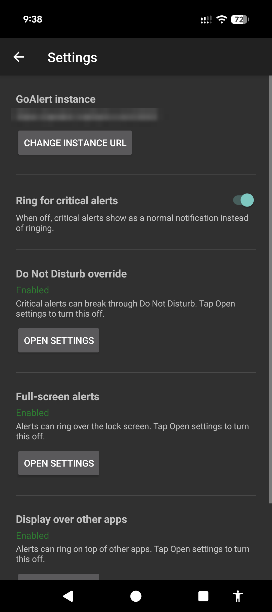
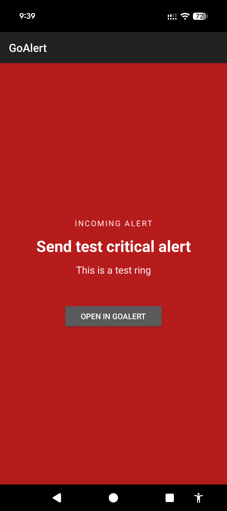

# GoAlert Android

A lightweight Android app that wraps [GoAlert](https://github.com/target/goalert)'s web UI in a WebView and adds native push notifications via Firebase Cloud Messaging (FCM).

## Features

- Full GoAlert web UI in a WebView (uses existing session/cookie auth)
- Full-screen **ringing** critical alerts that break through Do Not Disturb and the lock screen, with an Acknowledge/Open action
- High-priority FCM push notifications for alerts (bypasses Doze mode)
- Two notification channels: critical alerts (DND-bypass capable) and status updates
- In-app controls: ring on/off, plus status + shortcuts for the DND override, full-screen, and display-over-other-apps permissions
- Deep-links from notifications directly to the alert page
- Automatic FCM token registration and refresh

## Screenshots

| Alerts (WebView) | Settings | Critical alert ring |
|---|---|---|
|  |  |  |

## Requirements

- Android 8.0+ (API 26)
- A GoAlert instance with the FCM provider enabled
- Firebase project with Cloud Messaging enabled

## Setup

1. Place your `google-services.json` in `app/` (get it from the Firebase console)
2. Build: `./gradlew assembleDebug`
3. Install: `adb install app/build/outputs/apk/debug/app-debug.apk`

On first launch, enter your GoAlert instance URL, log in, and grant notification permissions. The app registers your device for push notifications automatically.

> **Note:** the instance must be served over **HTTPS**. Cleartext (`http://`) traffic is
> blocked by the app's network security config, so an `http://` URL will fail to connect.
> If you omit the scheme, `https://` is assumed.

## GoAlert Server Configuration

In GoAlert Admin > Config > FCM:
- Enable FCM
- Paste your Firebase service account credentials JSON (from Firebase console > Project Settings > Service accounts > Generate new private key)

## License

Apache License 2.0
